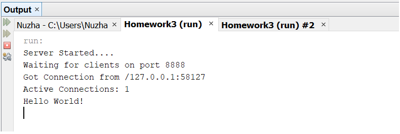
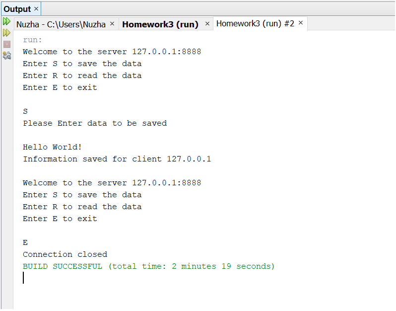

# Multi-Client-TCP-Server-Communication
This project creates a Multi-Client-TCP-Server-Communication using multi-threading in Java.

The functions of Server and Client are described below.
## Server
1. If the sever is idle (no client connected to the server), an information message is displayed “Waiting for clients on port {port_num}”. Note: port_num is the port number on which your server is running
2. When a client tries to connect to the server, an information message is displayed “Got connection from {client_IP}:{client_port}”. Note: client_IP is the IP Address of your client and client_port is the port number on
which your clientis running
3. To show the number of active clients after every client connection, an information message is displayed “Active Connections = {active_count}”. Note: active_count is the number of active clients
4. The information sent from the client is read  
    1. An information message “Welcome to the server {server_IP}:{server_port}” is displyed. Note: server_IP is the IP Address of your server and server_port is the port
number on which your serveris running  
    2. If the client wants to save the data to the server  
        * If the file with the clientIP exists on the server  
            1. We append the information in the file 
        * If the file with client IP does not exists on the server 
            1. We sreate a file with IP address 
            2. Then we save the information to the file 
        * Now we display information message “Information saved for client {client_IP}” 
    3. If the clientwants to read the data from the server 
        * We check if the file for client exists on the sever 
            1. An information message “Information for client {client_IP}” is displayed 
            2. The information from the file is displayed 
        * If no file for the client exists on server 
            1. An information message “No Information found for client {client_IP}" is displayed  
            
The Server output in running state is shown below.

## Client
1. We display information message when client becomes active “Client {client_IP}is active.”
2. We check if the Client wants to Get information from the sever of upload some data to the sever
    1. If client wants to upload data to server
        1. We read data from input stream and upload to server
    2. If the client wants to get data from server
        1. We read the data from the server
        2. Then we write the data to the file on client side
Note: File name is in the format {ClientIP}_{ServerIP}.txt

The Client output in running state is shown below.

## How to run
Open the three Java files in any Java IDE with ``Homework3.java`` being the main source file. Run the ``Homework3.java`` file to initiate the Server. Now run ``Client.java`` file any number
of times since the server can entertain multiple clients
